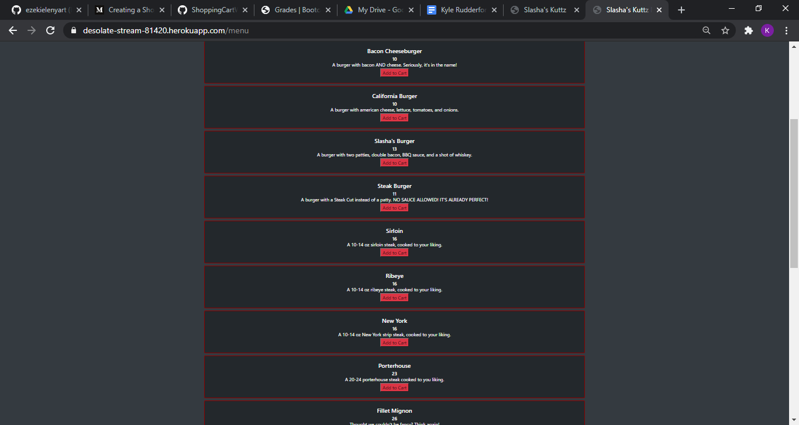
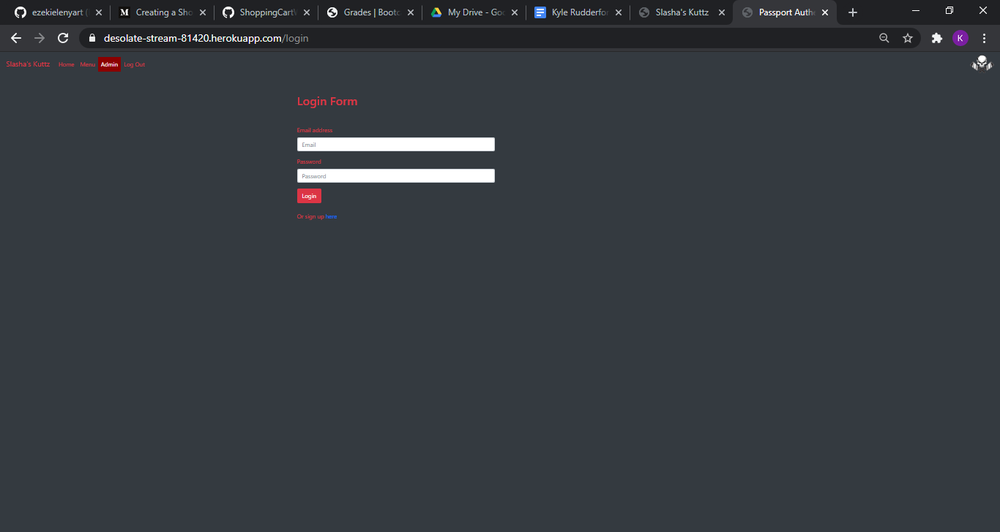
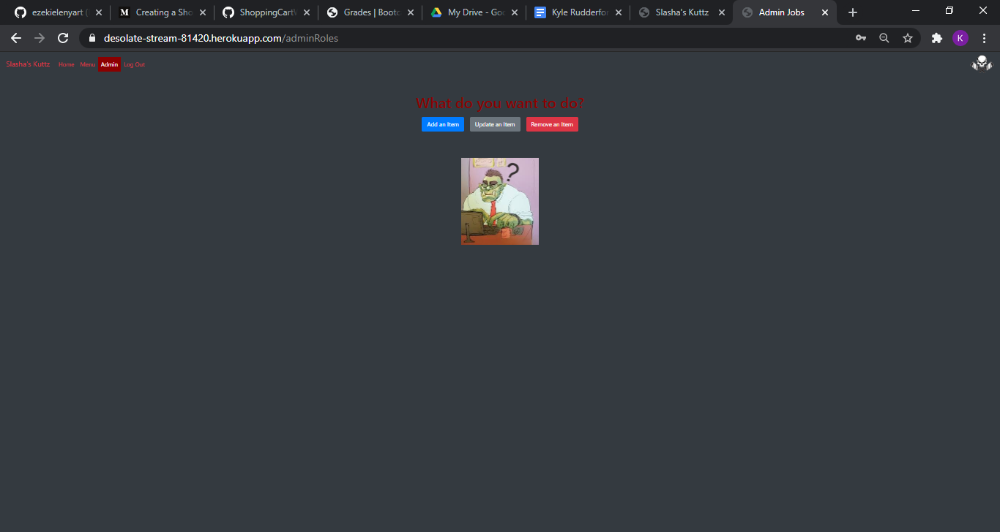

  # Project Title: Restaurant Menu Creator

  ## Project Description:
 
  This application allows for 2 cases: First, it allows a manager of a restaurant to update the items on their menu. Second, it allows customers to view the items the restaurant is serving

  ## Table of Contents
  * [Installation](#installation)
  * [Usage](#usage)
  * [License](#license)
  * [Credits](#credits)
  * [Contributors](#contributors)
  * [Test](#test)
  * [Screenshot](#screenshot)
  * [Video](#video)
  * [Questions](#questions)
  * [Badges](#badges)
  
  ## Installation:

    Dependencies:
    -bcryptjs
    -express
    -express-session
    -mysql2
    -passport
    -passport-local
    -sequelize
 
  You would need to clone or fork the repo. You will have to install the dependencies and run npm install.

  ## Usage:
 
  After everything is forked and Installed you will need to put your mysql user name and password in the config.json and then need run nodemon server.js and that will let you know the server is working. If you would like to run locally you can put http://localhost:8080/ in your your favorite web browser or you can use the heroku link that is below. Then have fun.

  ## License:
  

  ## Credits:

  Ezekiel Enyart and Kyle Rudderforth
   
  Git Hub Repo: https://github.com/ezekielenyart/Restaurant-Menu-Creator
   
       Heroku Link: https://desolate-stream-81420.herokuapp.com/
  
  ## Contributors:
  
  none

  ## Test:
   
  none

  ## Screenshot:

  
  
  
  

  ## Video

  

  ## Questions:
  
  You can reach out to us useing other one of our github profile.
  
  Git Hub Profile: 
   
  https://github.com/kruddzz
   
  https://github.com/ezekielenyart

  ## Badges:
  
  